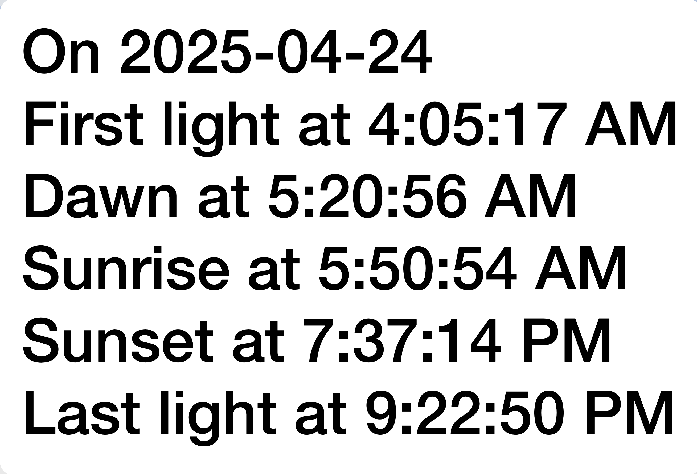

# SunriseSunset Alfred Workflow

A macOS Alfred workflow that displays sunrise/sunset times for your current location on a specific date (default today).



## ⚙️ Setup

1. **Install the Workflow**  
   Download the `.alfredworkflow` file and double-click to install.

2. **No Manual Setup Required**  
   This workflow includes its own **Python virtual environment**, pre-installed with all required packages (like `geocoder`).

3. **Requirements**
   - macOS
   - [Alfred](https://www.alfredapp.com/) with the Powerpack
   - Python 3 (recommended: via [Homebrew](https://brew.sh/))

## Usage

Type your Alfred keyword (default is "sun") followed by a date like:

- `t` (today)
- `t+2` (two days from today)
- `04-19` or `04/19` (MM-DD)

If no argument is provided, it will display information for today.

## Install the workflow

Download the .alfredworkflow file and double-click it to install into Alfred.

## Configuration

No configuration needed!

This workflow includes a self-contained Python virtual environment, so you don’t need to worry about dependencies.

## 🧰 Required Python Packages (for reference only)

You **do not** need to install these manually — the virtual environment bundled with this workflow already includes them.

If you ever want to recreate the environment:

    ```bash
    python3 -m venv venv
    source venv/bin/activate
    pip install geocoder

## ❓ Troubleshooting

If you encounter an error like:

    ModuleNotFoundError: No module named 'geocoder'

it usually means the virtual environment wasn’t bundled correctly or is not being used. Try re-installing the workflow or rebuilding the virtual environment using the steps above.

### Optional Tweaks

If you want to edit the script, right-click the workflow in Alfred → "Show in Finder" → Open `SunriseSunset.py`.

## 📦 Download

[Download the latest .alfredworkflow file](https://github.com/drdannysands/sunrisesunset/releases)


## Planned enhancement

Permit workflow configuration to permit script to accept DD/MM instead of MM/DD.

## 🤝 Contributing

Pull requests are welcome. For major changes, please open an issue first to discuss what you’d like to change.

## 📄 License

MIT License.

## Background

I had a need for this functionality, so I used it as a learning exercise.

It utilizes a Python script, sunrisesunset.py. The script interprets and normalizes the argument, queries one server to find the user's location in latitude and longitude and then queries another server that provides sunrise and sunset information. The it parses the response and displays it.

## Credits

    Danny Sands 
    danny@drdannysands.com
    github.com/drdannysands/sunrisesunset

    All comments and suggestions welcome.
